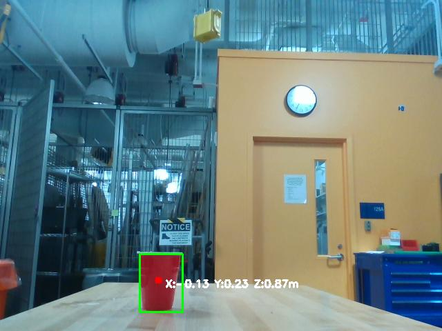
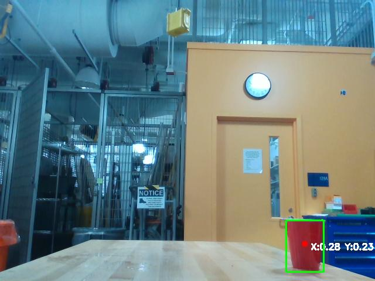

# KinoVaPong

A Kinova Gen3 Lite ping-pong-ball throwing project from **Intro to Robotics, Fall 2025**, presented by Muhammad Ahmed with acknowledgment of his teammates.

[View the project presentation](https://ahmedshaikh77.github.io/robotics-final-portfolio/) · [Watch the demo](videos/throw_10deg.mp4) · [Explore the design details](docs/PROJECT_EVIDENCE.md)

This repository contains the static case study and supporting media. It does **not** contain the ROS 2 nodes, robot configuration, or experiment logs needed to reproduce the robot system.

## Project overview

The [project page](index.html) describes a supervised pick-and-throw workflow: a human places the ball and cup, the arm picks up the ball, a camera-derived cup angle guides alignment, and an angle-triggered gripper release launches the ball. The operator supervises and resets each trial.

The presentation reports the following components:

- Kinova Gen3 Lite arm, 2F gripper, and Intel RealSense camera.
- ROS 2 and MoveIt 2 for coordination and motion planning.
- A `BeerPongThrow` control node, which the page credits Muhammad Ahmed with implementing, and a separate `RedCupAnglePublisher` vision node.
- Joint-angle monitoring, concurrent callbacks, and a planning-scene collision object for the ball.

The [project evidence guide](docs/PROJECT_EVIDENCE.md) expands on the control sequence, interfaces, and supporting artifacts.

## Preview locally

You need Python 3 and a web browser. There is no package installation, build step, backend, or environment-variable setup for the presentation.

From the repository root, where `index.html` is located, run:

```sh
python3 -m http.server 8000 --bind 127.0.0.1 --directory .
```

Open [the local project page](http://127.0.0.1:8000/). The page is served at `/`, not `/robotics-final-portfolio/`, because this command serves the repository itself as the web root. Stop the server with `Ctrl+C`.

The page contains Overview, System Design, Control & Trajectory, and Experiments sections, plus a browser-controlled video player. Its styles are embedded in `index.html`; it does not load a JavaScript application or external web libraries.

If the port is already occupied, choose another port and use that port in the browser URL. If the video is missing, confirm that the server was started from the repository root and that the `videos/` directory is present.

## Repository contents

```text
robotics-final-portfolio/
├── index.html                 # Project narrative, inline styles, and video player
├── images/
│   ├── cup_center.jpeg        # Annotated cup image, 640 × 480
│   └── cup_right.jpeg         # Annotated cup image, 640 × 480
├── videos/
│   └── throw_10deg.mp4        # Video embedded in the project page
├── README.md
└── docs/
    └── PROJECT_EVIDENCE.md    # Reported design, evidence, and limitations
```

## Media

- [Demo video](videos/throw_10deg.mp4): the recording embedded in the page's “Demo throw / Final check-off” panel.
- [Center-position cup image](images/cup_center.jpeg): a red cup with a bounding box and coordinate overlay.
- [Right-position cup image](images/cup_right.jpeg): a second annotated view with the cup farther right in the image.

 

These two images show the supplied detection overlays. They are not currently embedded in `index.html`.

## Engineering lessons described

The presentation highlights coordinating pickup, alignment, throwing, and reset as a sequence; using joint feedback to trigger an action during motion; and keeping callbacks and timers responsive during a long-running motion command. It also reports that release angle and velocity scaling affected the landing point.

## Results and implementation boundaries

The Experiments section explicitly labels its table as a **placeholder**. Its `100%` hit-rate entry, `35cm` distance, and `1 & 6` shots entry must not be presented as validated performance results. There are no raw trial records, reproducible evaluation scripts, or documented statistical analysis in this repository.

A ballistics model and automatic optimization for arbitrary cup positions are described as future work, not implemented features.

Local preview runs only the website. This repository is not an operating procedure or a safety guide for robot hardware.

## Documentation and contributions

For documentation updates, keep the distinction between observed files and reported project outcomes. Preserve the author's attribution and the acknowledgment of teammates. Link new claims to supporting source, recordings, or trial records; do not replace missing evidence with inferred metrics.

Before proposing a change, preview the page and check its relative media paths. This repository currently has no automated test suite. Keep presentation, media, implementation, and documentation changes clearly separated in the change description.
